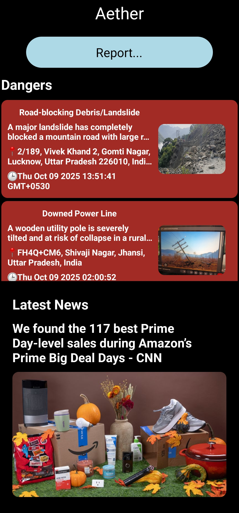
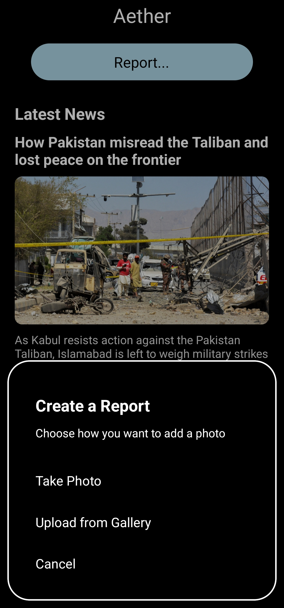
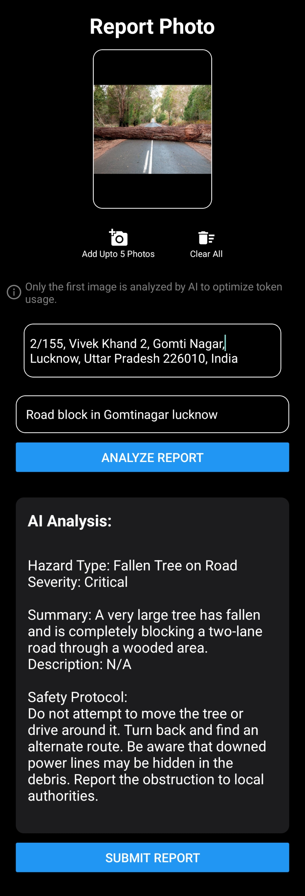
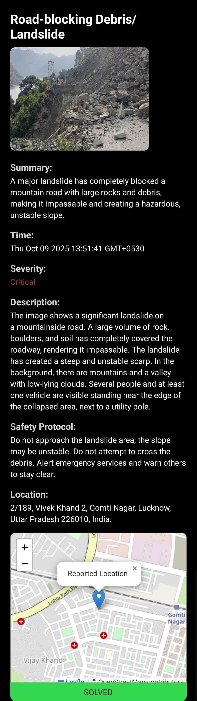

# Aether: AI-Powered Disaster Response
 


**Aether is a sophisticated disaster response and emergency reporting mobile application built for the Thales Hackathon 2025 under the "AI-Powered Solutions" theme.** 
It leverages cutting-edge AI to provide real-time hazard analysis, bridging the gap between traditional emergency systems and modern disaster management technology.

### 🎥 [Watch the Video Demo](https://drive.google.com/file/d/1VjGo_tm0HbJluQe5yS6WlwH6UyIDoy3A/view?usp=sharing) | 📱 [Download the App](https://drive.google.com/file/d/1RjuRmNz9o65mMPFZjGuZVoJF_AQxOkAj/view?usp=drive_link) 

---

## 🌟 Key Features

* **AI-Powered Analysis:** Utilizes Google Gemini to instantly classify damage from user-submitted photos into 8 distinct hazard types.
* **Real-time Dashboard:** A live feed of nearby dangers, with color-coded severity indicators and automatic updates powered by Firebase Firestore.
* **Multi-modal Reporting:** Users can submit reports using their camera or by uploading from their gallery, complete with precise GPS location and reverse geocoding for a street address.
* **Automated Safety Protocols:** The AI automatically generates relevant safety guidelines based on the classified hazard, providing users with actionable intelligence. 
* **Interactive Maps:** Each report includes an interactive map view showing the exact location of the hazard.
* **Live News Feed:** An integrated news section, powered by the NewsAPI, keeps users informed with the latest relevant headlines. 

## 📸 Screenshots

<p float="left">
  
  
  
  
  
  
  
 
  
</p>

---

## 🛠️ Tech Stack

* **Frontend:** React Native, Expo 
* **Routing:** Expo Router
* **State Management:** Zustand 
* **Backend & Database:** Firebase Authentication & Cloud Firestore 
* **Image Storage:** Cloudinary 
* **AI & Machine Learning:** Google Gemini API 
* **Geolocation:** Expo Location, TrueWay Geocoding API 
* **News:** NewsAPI 

---

## 🚀 Setup and Installation

**Prerequisites:**
* Node.js and npm installed.
* Expo Go app on your mobile device.

**Instructions:**

1.  **Clone the repository:**
    ```bash
    git clone [https://github.com/Tubelight189/Aether.git](https://github.com/Tubelight189/Aether.git)
    ```
2.  **Navigate to the project directory:**
    ```bash
    cd aether-hackathon
    ```
3.  **Install dependencies:**
    ```bash
    npm install
    ```
4.  **Create a `.env` file** in the root of the project and add your API keys:
    ```
    EXPO_PUBLIC_GEO_API_KEY
    EXPO_PUBLIC_GEMINI_API_KEY
    EXPO_PUBLIC_NEWS_API_KEY
    EXPO_PUBLIC_FIREBASE_API_KEY
    EXPO_PUBLIC_AUTH_DOMAIN_API_KEY
    EXPO_PUBLIC_PROJECT_ID_API_KEY
    EXPO_PUBLIC_STORAGE_BUCKET_API_KEY
    EXPO_PUBLIC_MESSAGING_SENDER_ID_API_KEY
    EXPO_PUBLIC_APP_ID_API_KEY
    EXPO_PUBLIC_MEASURENENT_ID_API_KEY
    ```
5.  **Start the development server:**
    ```bash
    npx expo start
    ```
6.  **Scan the QR code** with the Expo Go app on your phone to run the application.

---

## 🧑‍💻 Author

* **Arnav Adarsh** - [GitHub Profile](https://github.com/Tubelight189)